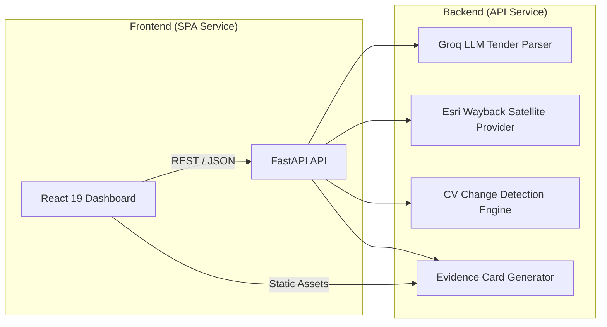

# Sentra: AI-Powered Satellite Audit for Public Infrastructure

[](https://www.python.org/)
[](https://fastapi.tiangolo.com/)
[](https://react.dev/)
[](https://www.typescriptlang.org/)
[](https://vitejs.dev/)
[](https://vercel.com/)

**Sentra** detects non-existent ("ghost") public infrastructure projects, monitors construction progress, and flags budget leakage using dual-temporal satellite imagery analysis.

The repository is structured into two completely decoupled, independently deployable services: a **Python API Backend** and a **React 19 SPA Frontend**, configured for seamless Vercel deployment.

---

## Recommended Production Tech Stack

For production readiness and scale, Sentra adopts the following decoupled stack:

| Component / Layer | Recommended Technology | Why / Production Value |
|-------------------|------------------------|------------------------|
| **Backend Framework** | **FastAPI (Python 3.11+)** | Native fit for CV/NumPy/PyTorch pipelines, async I/O workers, Pydantic v2 validation, automatic OpenAPI specs. |
| **Async Worker Queue** | **Celery + Redis** | Offload heavy satellite image tile fetching (Esri Wayback) and CV spectral change calculations from main HTTP request loops. |
| **Database & GIS Store** | **PostgreSQL + PostGIS** | Replace local JSON store with spatial polygon indexing, spatial queries, and transactional audit history logs. |
| **Object Storage** | **AWS S3 / Cloudflare R2** | Persist high-resolution satellite imagery tiles, HTML evidence cards, and raw PDF tender uploads behind a global CDN. |
| **Frontend SPA** | **React 19 + TypeScript + Vite** | High-performance SPA client dashboard with type safety, fast static bundling, and instant HMR. |
| **State & API Client** | **TanStack Query (React Query)** | Client-side API request caching, background polling for async audit jobs, automatic request retries, and clean mutation hooks. |
| **GIS Mapping** | **MapLibre GL / Leaflet** | Dual-temporal map swipe comparison tools, interactive bounding-box selection, and GPU-accelerated map layer rendering. |
| **Styling & UI** | **Tailwind CSS v4** | Modern dark-mode aesthetic, utility-first design system tokens, and dynamic glassmorphism UI components. |
| **Containerization** | **Docker Multi-stage** | Isolated containers (`python:3.11-slim` for API, `node:22-alpine` -> `nginx:alpine` for SPA). |
| **Hosting & Deployment** | **Vercel** | Single-repo or multi-project Vercel serverless deployment using `vercel.json`. |

---

## Architecture



---

## Project Structure

```
sentra/
├── backend/                 # Python API & audit pipeline (Independent service)
│   ├── src/
│   │   ├── api/app.py       # FastAPI REST endpoints
│   │   ├── parser/          # Tender parsing, OCR, geocoding
│   │   ├── satellite/       # Esri Wayback satellite tile fetcher
│   │   ├── cv_engine/       # SSIM + spectral change detection engine
│   │   └── report/          # Evidence cards & record storage
│   ├── data/                # Local cache, raw tenders, generated reports
│   ├── tests/               # Pytest suite
│   ├── main.py              # CLI entry point
│   ├── requirements.txt     # Backend dependencies
│   ├── README.md            # Backend developer docs
│   └── Dockerfile           # Backend container spec
├── frontend/                # React SPA dashboard (Independent service)
│   ├── src/
│   │   ├── api/client.ts    # Typed API client
│   │   └── components/      # Dashboard UI components
│   ├── package.json         # Frontend dependencies & scripts
│   ├── vite.config.ts       # Vite build & dev proxy config
│   ├── README.md            # Frontend developer docs
│   ├── vercel.json          # SPA routing fallback for Vercel
│   └── Dockerfile           # Multi-stage Nginx container spec
├── docker-compose.yml       # Local multi-service orchestration
├── vercel.json              # Vercel deployment configuration
└── README.md
```

---

## Quick Start (Local Development)

### 1. Run Backend Service

```bash
cd backend
pip install -r requirements.txt
cp ../.env.example .env   # Configure GROQ_API_KEY if available
python main.py serve
```

- API Base URL: **`http://127.0.0.1:8050`**
- OpenAPI Docs: **`http://127.0.0.1:8050/docs`**

### 2. Run Frontend Service

```bash
cd frontend
npm install
npm run dev
```

- Dashboard SPA: **`http://localhost:5173`**

---

## Building Independently

### Backend Service Build & Test

```bash
cd backend

# Run automated tests
python -m pytest tests/ -v

# Build Docker image
docker build -t sentra-backend .
```

### Frontend Service Build & Test

```bash
cd frontend

# Build static SPA bundle (TypeScript check + Vite build)
npm run build

# Build Docker image
docker build -t sentra-frontend .
```

---

## Docker Compose (Dual Service)

To run both independent containers locally with orchestrating networking:

```bash
cp .env.example .env
docker compose up --build
```

- API Service: `http://localhost:8050`
- Web Dashboard Service: `http://localhost:5173`

---

## Vercel Deployment

Deploy directly to Vercel via CLI or GitHub integration:

```bash
# Install Vercel CLI (optional)
npm i -g vercel

# Deploy whole project using vercel.json configuration
vercel
```

- **Full Project Monorepo**: Uses root `vercel.json` to build `frontend/` as a static SPA and `backend/src/api/app.py` as a Python Serverless Function.
- **Frontend-Only Project**: Import `frontend/` directory into Vercel. Set `VITE_API_URL` environment variable in Vercel project settings pointing to your live backend API.

---

## License

MIT
