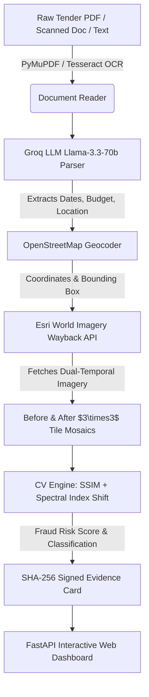

# Sentra: AI-Powered Satellite Audit for Public Infrastructure

[](https://www.python.org/)
[](https://fastapi.tiangolo.com/)
[](https://groq.com/)
[](https://livingatlas.arcgis.com/wayback/)
[](LICENSE)

**Sentra** is an space-borne AI audit platform designed to detect non-existent ("ghost") public infrastructure projects, monitor construction progress, and flag budget leakage using dual-temporal satellite imagery analysis.

By combining **Groq LLM text parsing (`llama-3.3-70b-versatile`)**, **PyMuPDF / Tesseract OCR**, **OpenStreetMap Geocoding**, **Esri World Imagery Wayback satellite archives**, and **Computer Vision Change Detection (SSIM + NDVI/NDBI Spectral Shift)**, Sentra automatically cross-references official tender documents against space-borne physical reality.

---

## 🌟 Key Features

- 📄 **Multi-Format Tender Document Ingestion**: Supports digital PDFs, scanned image PDFs (via PyMuPDF & Tesseract OCR), image files (`.png`, `.jpg`), and plain text circulars.
- 📂 **Automated Folder Batch Processing**: Drop tender documents directly into `data/raw_tenders/` for automatic text extraction, parsing, satellite fetching, and evidence card generation.
- 🤖 **Groq LLM Structured Extraction**: Utilizes `llama-3.3-70b-versatile` to extract tender IDs, project titles, issuing departments, budget amounts, start/completion dates, and location details.
- 🗺️ **OpenStreetMap Geocoding**: Converts tender location text into latitude/longitude coordinates with dynamic landmark fallback logic.
- 🛰️ **Esri World Imagery Wayback Satellite Engine**: Fetches historical sub-5m satellite imagery for exact start and completion dates (with configurable 2-3 month buffer).
- 🧩 **Multi-Tile $3 \times 3$ Mosaic Stitching**: Downloads and stitches 9 adjacent satellite tiles at Zoom Level 16 (~2.3m/pixel spatial resolution) into a $512 \times 512$ high-definition composite canvas.
- 🔍 **CV & Spectral Change Detection Engine**:
  - **Structural Change (SSIM)**: Measures physical surface structural alterations.
  - **Spectral Shift Index (NDVI / NDBI)**: Computes vegetation and built-surface transformation.
  - **Fraud Risk Scoring**: Probabilistic classification (`HIGH_PHYSICAL_CHANGE_VERIFIED`, `PARTIAL_CHANGE_DETECTED`, `PRIORITY_FIELD_VERIFICATION_RECOMMENDED`).
- 📊 **SHA-256 Signed Evidence Cards & Triage Dashboard**: Generates tamper-evident HTML evidence cards and an interactive web dashboard for audit teams.

---

## 🏗️ System Architecture



---

## 🛠️ Tech Stack

- **Backend Framework**: Python 3.11, FastAPI, Uvicorn, Pydantic v2
- **Large Language Model (LLM)**: Groq API (`llama-3.3-70b-versatile`)
- **Document OCR & Extraction**: PyMuPDF (`fitz`), PyTesseract, Pillow
- **Geospatial & Geocoding**: Requests, Geopy, OpenStreetMap Nominatim API
- **Satellite Imagery**: Esri World Imagery Wayback API (`https://livingatlas.arcgis.com/wayback/`)
- **Computer Vision**: OpenCV (`cv2`), Scikit-Image (`SSIM`), NumPy
- **Frontend / Reporting**: Modern Dark-Mode Glassmorphism HTML/CSS, Jinja2, Mermaid.js

---

## 🚀 Quick Start

### 1. Prerequisites
- Python 3.10+
- [Tesseract OCR](https://github.com/UB-Mannheim/tesseract/wiki) installed on your system (optional, required for scanned PDF OCR).

### 2. Installation
```bash
# Clone the repository
git clone https://github.com/Th4nveer/Sentra.git
cd Sentra

# Install dependencies
pip install -r requirements.txt
```

### 3. Environment Configuration
Create a `.env` file in the root directory:
```env
GROQ_API_KEY=your_groq_api_key_here
GEOLOCATION_USER_AGENT=Sentra-Satellite-Audit/1.0
SENTRA_ENV=development
SENTRA_PORT=8000
SENTRA_HOST=127.0.0.1
CACHE_DIR=./data/satellite_cache
REPORTS_DIR=./data/reports
```

---

## 💻 Usage

### Command Line Interface (CLI)

#### 1. Batch Scan Folder
Copy tender PDF/text files into `data/raw_tenders/` and run:
```bash
python main.py scan
```

#### 2. Run Built-in Realistic Demo Suite
```bash
python main.py demo
```

#### 3. Run Web Application Server
```bash
python main.py serve --port 8000
```
Open **[http://127.0.0.1:8000](http://127.0.0.1:8000)** in your browser.

---

## 🧪 Running Unit Tests

Run the unit test suite with `pytest`:
```bash
python -m pytest tests/ -v
```

---

## 📜 Project Structure

```
Sentra/
├── data/
│   ├── raw_tenders/       # Drop new tender PDFs / documents here
│   ├── processed/         # Processed tender documents auto-moved here
│   ├── sample_tenders/    # Pre-packaged demo tender circulars
│   ├── satellite_cache/   # Local satellite numpy arrays & RGB images
│   └── reports/           # Generated SHA-256 evidence cards & dashboard
├── src/
│   ├── api/
│   │   └── app.py         # FastAPI Web Application & API Endpoints
│   ├── parser/
│   │   ├── document_reader.py # PDF text & Tesseract OCR reader
│   │   ├── folder_scanner.py  # Batch tender directory scanner
│   │   ├── geocoder.py        # Nominatim geocoding & landmark resolver
│   │   ├── models.py          # Pydantic data schemas
│   │   └── tender_parser.py   # Groq LLM & regex tender parser
│   ├── satellite/
│   │   ├── wayback_api.py     # Esri World Imagery Wayback client & 3x3 mosaic
│   │   ├── fetcher.py         # Dual-temporal imagery fetcher facade
│   │   └── synthetic_provider.py # Demo simulation provider
│   ├── cv_engine/
│   │   ├── detector.py        # Change detection pipeline & fraud scoring
│   │   └── spectral.py        # SSIM, NDVI, NDBI spectral shift functions
│   └── report/
│       ├── evidence_card.py    # SHA-256 evidence card generator
│       ├── record_store.py     # Persistent JSON database manager
│       └── triage_dashboard.py # Global triage dashboard builder
├── tests/                 # Unit test suite
├── main.py                # CLI Orchestrator & Entry Point
├── requirements.txt       # Project dependencies
└── README.md
```

---

## 🛡️ License

This project is licensed under the MIT License - see the [LICENSE](LICENSE) file for details.
